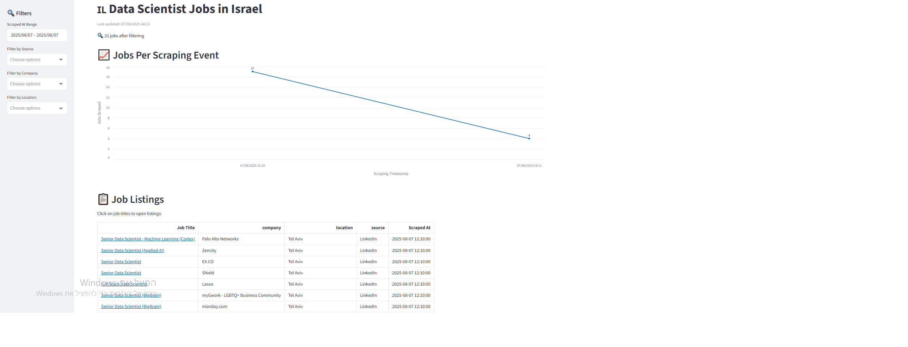

# 🇮🇱 Data Scientist Job Tracker – Israel

A Python-based system that scrapes job listings for Data Scientist roles in Israel from **LinkedIn**, **Amazon**, and **Monday.com**, and visualizes them in a live-updating **Streamlit dashboard**.

---

## 📁 Project Structure

```
DataScintists_jobs_Israel/

scrapers.py            # Scraping logic for LinkedIn, Amazon, Monday

main.py               # Periodic job runner (every 2 hours)

dashboard.py          # Streamlit dashboard code

data_scientist_jobs_israel.csv  # Auto-generated data file

requirements.txt

README.md
```

---

## ⚙️ Setup Instructions

### 🔁 Step 1 – Clone and Setup Environment

```bash
git clone https://github.com/NassiDudi/DataScintists_jobs_Israel.git
cd DataScintists_jobs_Israel
python -m venv jobs
jobs\Scripts\activate
pip install -r requirements.txt
python main.py
```

This will run the job scraping loop every 2 hours and save new results into the CSV file.

---

### 📊 Step 2 – Run the Streamlit Dashboard (in a second terminal)

```bash
jobs\Scripts\activate
streamlit run dashboard.py
```

This opens an interactive dashboard showing number of jobs per scraping event and a searchable job table.

---

## 🧠 Notes

- You need **Google Chrome** and **ChromeDriver** installed and available in PATH.
- Scraper adds a `None` entry if no jobs were found during a scrape (so dashboard reflects 0 results).
- Dashboard filters include: **date**, **company**, **source**, and **location**.

---

## 📦 Requirements

All dependencies are listed in `requirements.txt`. To install them:

```bash
pip install -r requirements.txt
```

---

## 📅 Author

Created by [דודי נשיא (Dudi Nassi)](https://github.com/NassiDudi)
